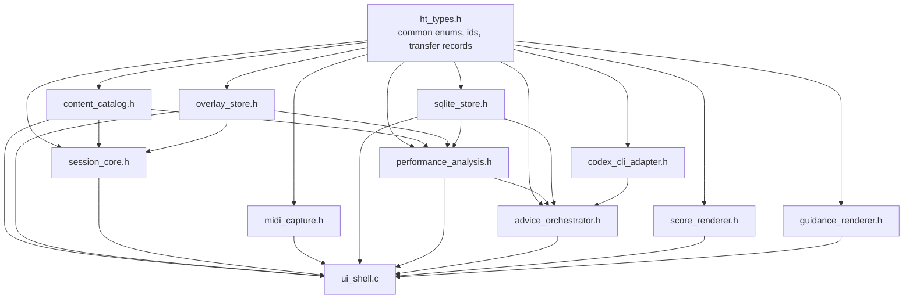
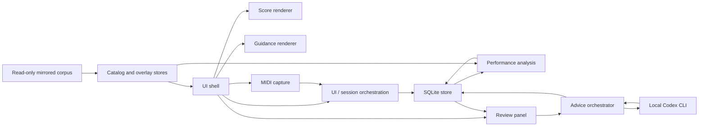

# Architecture

`hanon-trainer` is a local-only desktop practice app for score-guided piano
practice in `C`.

The first build captures MIDI from a local device, stores completed takes in
SQLite, computes post-session pitch and timing metrics against overlay-backed
expectations, and optionally invokes the local Codex CLI to turn those metrics
into a review summary and practice advice.

The core architectural rule is to keep stable domain libraries separate from
volatile integrations such as MIDI drivers, SQLite I/O, and Codex process
execution.

## Compile-Time Dependency Graph

Arrows point from a lower-level library or common header to a library that is
allowed to depend on it.

This graph is intentionally acyclic. UI composition happens at the edge of the
program and does not define library ownership.

## C Library Split

| Header / Unit | Role | Mutable State Exposure |
| --- | --- | --- |
| `ht_types.h` | shared enums, ids, status codes, transfer records | plain value types only |
| `content_catalog.h` | read-only lookup of variants and mirrored asset paths | opaque catalog handle |
| `overlay_store.h` | read-only lookup of overlay metadata and step expectations | opaque overlay-store handle |
| `session_core.h` | selected variant, hand mode, tempo target, current take state | opaque session handle |
| `midi_capture.h` | device enumeration, capture start/stop, timestamped MIDI events | opaque capture handle |
| `sqlite_store.h` | schema migration, state persistence, session/event/result storage | opaque database handle |
| `performance_analysis.h` | pitch/timing comparison for completed takes | owns no long-lived state; reads session data and writes result records |
| `codex_cli_adapter.h` | explicit local Codex process invocation | opaque adapter handle |
| `advice_orchestrator.h` | prompt assembly, Codex calls, advice persistence | owns no long-lived state; coordinates adapters and result records |
| `score_renderer.h` | score asset placement and overlay emphasis | renderer-local state only |
| `guidance_renderer.h` | keyboard and fingering presentation from active step | renderer-local state only |
| `ui_shell.c` | event loop, view composition, user commands | app-owned state only |

## C Interface Posture

- Each semantically connected library gets one public `.h` file and one or more
  `.c` translation units.
- Public headers are C ABI surfaces: named prototypes, C scalar types, opaque
  handles, and plain `ht_` records only.
- All public functions must have prototypes in headers.
- Mutable services use opaque handles such as
  `typedef struct ht_catalog ht_catalog;`.
- Stable data exchanged between libraries uses plain transfer structs prefixed
  with `ht_`.
- Fallible operations return `ht_status`.
- On `HT_OK`, caller-provided output handles and records are fully initialized.
- On non-`HT_OK`, output records and handles are left null or zeroed unless a
  function explicitly documents an informative output such as a required count.
- Buffers and pointer arguments must have documented ownership and size
  expectations.
- Handle lifetime must be explicit through paired functions such as
  `*_open` / `*_close`, `*_create` / `*_destroy`, or `*_load` / `*_free`.
- Public APIs avoid varargs and macro-only call sites for ordinary operations.
- Source-derived corpus assets remain read-only at runtime. All user-generated
  state goes through SQLite, never back into the mirrored corpus.

## Diagnostic Tools

Standalone command-line diagnostics live under `tools/`. They may talk directly
to volatile platform APIs, but they do not extend the public C library surface
or add public headers.

`tools/ht_midi_probe.c` is the first such tool. It validates ALSA sequencer
visibility and event decoding before `midi_capture` is enabled for live
hardware. It writes event rows to stdout, status and errors to stderr, does not
write SQLite, and leaves `ht_midi_capture_start` in its current unsupported
state.

`tests/fixtures/synthetic-pc4-capture` is the first diagnostic fixture for this
tooling lane. It preserves a screenshot-derived Kurzweil PC4 channel-pressure
trace in the `ht_midi_probe --format tsv` shape and is intentionally used for
decode/schema coverage only, not timing analysis.

Tool sources use the same seven-section companion-document shape as `src/*.c`
and `tests/*.c`; CTest enforces this for `tools/*.c`.

## Runtime Flow

## Session Lifecycle

1. Open the catalog and overlay stores from the local read-only corpus.
2. Open SQLite, run schema migration if needed, and load the last saved user
   state.
3. Resolve the active variant and overlay coverage level in `session_core`.
4. Render the selected score asset and guidance surfaces in browse mode.
5. When the user arms a MIDI device and starts a take, `midi_capture` emits
   timestamped events. The UI/session orchestration layer persists those events
   to SQLite under a new practice session.
6. When the take stops, `performance_analysis` loads the completed event stream
   plus overlay expectations and computes pitch and timing metrics.
7. The review panel shows local metrics immediately after analysis completes.
8. If the user requests AI help, `advice_orchestrator` builds a compact prompt
   from normalized session facts and exercise metadata, invokes the local Codex
   CLI, and stores the result as an advice artifact.

## Ownership Boundaries

- `content_catalog` owns source-derived metadata and asset path resolution only.
- `overlay_store` owns score regions, step order, expected pitch groups, timing
  windows, keyboard targets, and optional finger labels.
- `session_core` owns current selection, target tempo, armed-device choice, and
  current capture status. It does not own persistence or rendering.
- `midi_capture` owns device enumeration and capture mechanics. It does not own
  persistence and does not depend on SQLite.
- `sqlite_store` owns persisted user state, sessions, MIDI events, analysis
  outputs, and advice artifacts.
- `performance_analysis` consumes completed session data and overlay
  expectations; it does not own capture or UI state.
- `codex_cli_adapter` is an internal process boundary for running the local
  external tool. It does not expose a broad public prompt API and does not
  decide when advice is generated.
- `advice_orchestrator` owns typed advice request assembly and advice
  persistence; it does not change analysis truth.

## Failure And Degraded Modes

- missing score asset:
  show exercise metadata and an explicit missing-asset view without crashing
- missing overlay metadata:
  allow browse mode and score viewing, but disable scored analysis and mark the
  variant as not analysis-ready
- no MIDI device:
  keep viewer and guidance features available while disabling capture controls
- SQLite open failure:
  fail fast into a clear read-only error state rather than pretending progress
  can be saved
- malformed or truncated MIDI stream:
  mark the session as incomplete and skip scored analysis
- Codex timeout or non-zero exit:
  keep local metrics and review output, mark AI advice unavailable
- partial corpus coverage:
  label variants as `asset_only`, `guide_only`, `pilot_analysis`, or
  `analysis_ready` instead of implying universal support

## Deferred From The First Build

- microphone or audio waveform analysis
- real-time adaptive coaching during active capture
- fingering correctness scoring
- in-app overlay authoring
- notation re-engraving
- remote sync and account-backed workflows

## Related Documents

- [Local Spec](LOCAL_SPEC.md)
- [Data Model](DATA_MODEL.md)
- [Content Pipeline](CONTENT_PIPELINE.md)
- [Open Questions](OPEN_QUESTIONS.md)
